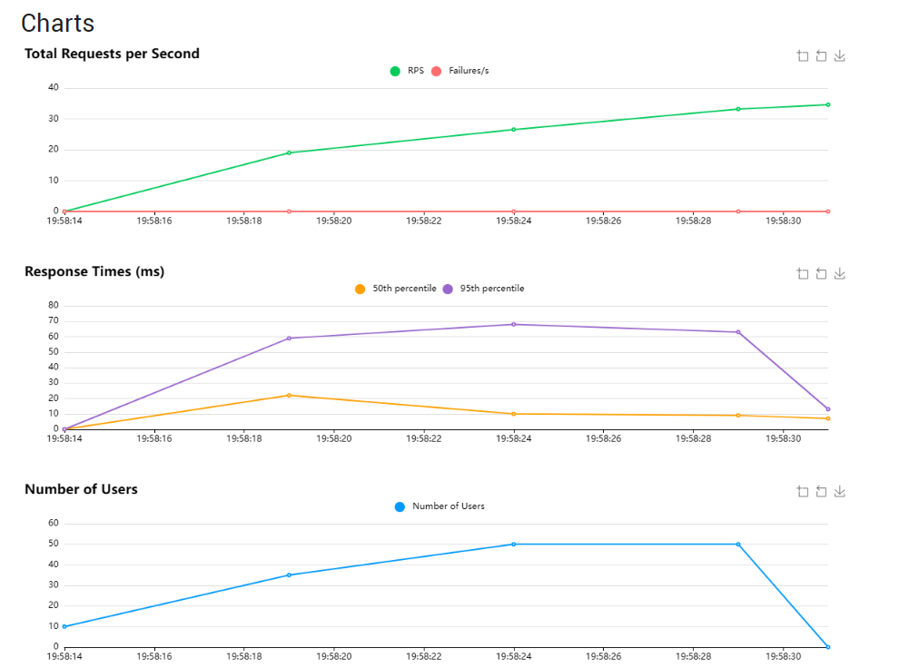
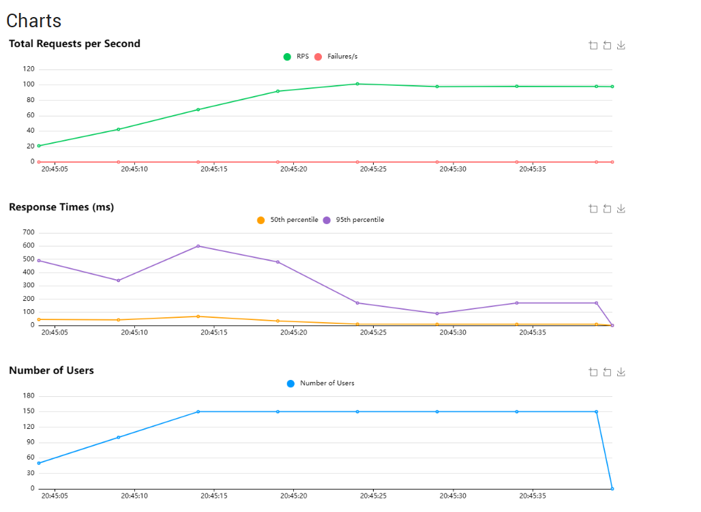
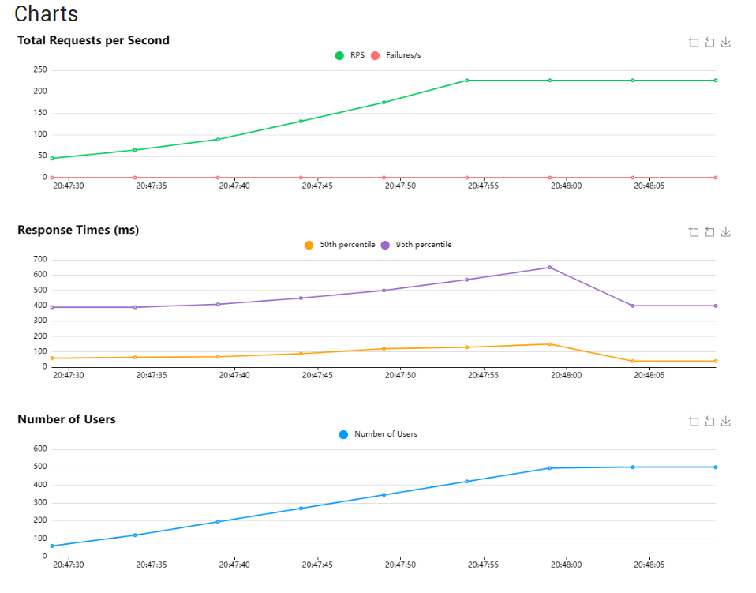

# Device Statistics Analytics API

Асинхронный backend-сервис для сбора, хранения и анализа статистики устройств.

Проект реализован в рамках тестового задания и включает:

- сбор статистики устройств
- аналитику показателей
- работу с пользователями и устройствами
- нагрузочное тестирование
- оптимизацию производительности PostgreSQL

---

## Стек технологий

- Python 3.12
- FastAPI
- SQLAlchemy 2.0 (async)
- PostgreSQL
- Alembic
- Pydantic
- Uvicorn
- Locust

---

## Функционал

### Устройства

- создание устройства
- получение устройства по ID
- получение устройств пользователя
- получение списка всех устройств

### Пользователи

- создание пользователя
- получение пользователя по ID
- получение списка пользователей

### Статистика устройств

- сохранение статистики устройства
- получение статистики устройства
- фильтрация по временному периоду

### Формат статистики

```json
{
  "x": 12.5,
  "y": 7.2,
  "z": 3.9
}
```

---

## Аналитика

Для устройств и пользователей реализован расчет:

- minimum
- maximum
- count
- sum
- median

Поддерживаются:

- аналитика за всё время
- аналитика за указанный период

Также реализованы:

- агрегированная аналитика по всем устройствам пользователя
- аналитика отдельно по каждому устройству пользователя

---

## Архитектура проекта

Проект построен по многослойной архитектуре:

```text
API Routes
    ↓
Services
    ↓
Repositories
    ↓
Database
```

### Слои

- **Routes** - обработка HTTP-запросов
- **Services** - бизнес-логика приложения
- **Repositories** - работа с базой данных (SQLAlchemy модели + запросы)
- **Schemas** - Pydantic-схемы запросов и ответов

---

## Структура проекта

```text
app/
├── api/
│   └── routes/
├── db/
├── core/
├── models/
├── repositories/
├── schemas/
├── services/
└── main.py
tests/
```

---

## База данных

Используется PostgreSQL. Миграции реализованы через Alembic.

# Запуск проекта

## Через Docker

1. Создайте файл `.env` в корне проекта:

```env
POSTGRES_USER=postgres
POSTGRES_PASSWORD=postgres123
POSTGRES_DB=stats_db

DATABASE_URL=postgresql+asyncpg://postgres:postgres123@db:5432/stats_db
DATABASE_URL_SYNC=postgresql://postgres:postgres123@db:5432/stats_db
```

2. Соберите и запустите контейнеры:

```bash
docker-compose build --no-cache
docker-compose up -d
```

3. Примените миграции:

```bash
docker-compose exec app alembic upgrade head
```

4. Проверьте работу:

http://localhost:8000/docs

5. Остановка:

```bash
docker-compose down
```

---
## Примеры запросов и ответов

### Создание пользователя

Запрос:
```bash
curl -X POST http://127.0.0.1:8000/users \
  -H "Content-Type: application/json" \
  -d '{"name":"Ben Ab"}'
```
Ответ:
```json
{
  "id": 4741,
  "name": "Ben Ab"
}
```

### Создание устройства
Запрос:

```bash
curl -X POST http://127.0.0.1:8000/devices \
  -H "Content-Type: application/json" \
  -d '{"user_id":1, "name":"Sensor A"}'
```
Ответ:

```json
{
  "id": 3832,
  "user_id": 1,
  "name": "Sensor A"
}
```
### Сохранение статистики

Запрос:
```bash
curl -X POST http://127.0.0.1:8000/stats \
  -H "Content-Type: application/json" \
  -d '{"device_id": 3832, "x": 12.5, "y": 7.2, "z": 3.9}'
```
Ответ:
```json
{
  "id": 17831,
  "device_id": 3832,
  "x": 12.5,
  "y": 7.2,
  "z": 3.9,
  "created_at": "2026-05-15T18:05:01.642784"
}
```
## Нагрузочное тестирование

Для нагрузочного тестирования использовался Locust.

### Сценарии тестирования

#### Легкая нагрузка


- 50 users
- 5 users/sec

**Результат:** p95 = 56ms, RPS ≈ 35, 0% failures

#### Средняя нагрузка

- 150 users
- 10 users/sec

**Результат:** p95 = 300ms, RPS ≈ 98, 0% failures

#### Стресс-нагрузка

- 500 users
- 15 users/sec

**Результат:** p95 = 500ms, RPS ≈ 226, 0% failures



---

## Основные выводы

- система стабильно работает под высокой нагрузкой
- аналитические запросы являются наиболее ресурсоемкой частью системы
- backend выдерживает стресс-нагрузку без ошибок

---
